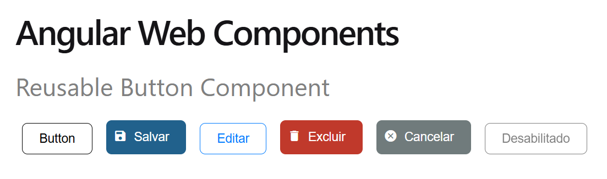

# Angular Web Components (em desenvolvimento)

Este projeto serve para praticar funcionalidades e aplicar conceitos de reuso de componentes no Angular 17.

### Pre-Requisitos
- Node.js 20
- Angular CLI 17

### Tecnologias

- Angular 17, 
- Angular Material,
- Node.js,
- Boostrap,
- Ícones Angular Material,
- JSON Server,
- Jasmine Karma,
- Cypress

## Screenshots

Page with reusable button component:

